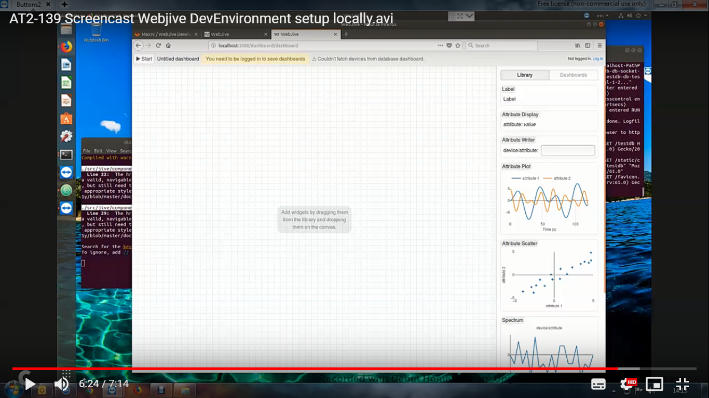

.. _ha393a784229712d311f637313726d5c:

Webjive User Information (AT2-113)
**********************************

The purpose of this guide is to provide new users of Webjive with information on the following:

* Overview of Webjive

* How to run Webjive locally

* How to use Webjive and connect with the Tango devices

.. _h3b797e79604d3c7d606d2c4e6c276259:

Overview
========

Webjive is a web-based program that allows a user to create a visual interface using widgets, which may include charts, numerical indicators or dials that interface to Tango device back end database.  Details of how this is programmatically achieved is presented in a developer biased document which can be found at: <\ |LINK1|\ >

Webjive was conceived and originally created by the MAX IV synchrotron facility in Lund, Sweden. During the early User Interface identification and downselect process conducted by the SKA OSO-UI Buttons team, Webjive was highlighted as a possible candidate to be taken forward as the platform upon which the SKA Engineering User Interface could be built.  In early 2019 discussions between MAX IV and OSO-UI Buttons team (overseen by SKA) were held and it was agreed that a collaborate relationship could be taken forward to develop and maintain Webjive.

.. _h471975525917306411685377125b4d50:

WebJive User Screen
===================

localhost:22484/testdb

\ |STYLE0|\ 

localhost:22484/testdb/dashboard

\ |IMG1|\ 

\ |STYLE1|\ 

.. _h1830404b7f71c2582a655d3c771e6f:

Left Hand Side column: TangoGQL
===============================

The left hand side of the web interface houses the accessible Tango database devices.  It should be possible to use the Tango Controls program Jive to access the same Tango devices database as what is presented in this column. Further details of this can be found \ |LINK2|\ .

.. _h706d5839407d276f27e246f252e22:

Right Hand Side column: Widgets
===============================

The right hand side of the web interface presents the Webjive widgets which can be utilised in the creation of the Engineering User Interface by the user . Examples of widget include, dials, gauges, charts, numerical indicators and graphs. Further details of this can be found \ |LINK3|\ .

.. _h6215c78343e3c1e1343b31e133876:

Steps to get Webjive running locally\ [#F1]_\ 
==============================================

The guide below assumes that the user has no previous versions of Webjive installed.  At the time of writing there are a number of ways in which Webjive can be launched.  However from a user point of view the way that should be adopted is given below because it will ensure that the ‘latest’ stable version is used. This guide assumes no previous versions of Webjive are present.

.. _h12681b476e22453e6648f35d1d6e1e:

Prerequisites
-------------

It is assumed that the following are installed and working correctly before attempting to launch Webjive:

* Python 2.7.x

* Make

* Sphinx

* Git

.. _hd5e6c7a422f6670e266d078184c27:

Steps
~~~~~

#. Obtain the latest ska-engineering-ui-compose-utils project from the. \ |LINK4|\  repository. The local ReadMe of this repository describes how to get Webjive up and running. Steps 2-4 below summarise the process.

#. Launch Webjive and TangoGQL using the following command: 

            make up

    This step may take some time to complete because all of the supporting material for Webjive will be acquired from various repositories before being installed.

#. Go to your local web-browser and enter the following into the address / URL bar:  

            localhost:22484/dashboard

    The web browser should present a screen similar to that shown in figure 2.

#. At the top right-hand corner of the webpage (not the browser) click on the login button and enter the following credentials\ [#F2]_\ . Currently SKA Webjive uses the generic username and password credentials:

    		Username: user1

    		Password: abc123

.. _h4b526307e43a643e2e3e1737607060:

Linking to TangoGQL
===================

This activity should be viewed as a developer level activity.  As such a procedure to add Tango devices to the linked database is provided in the SKA Developer portal at: \ |LINK5|\ 

.. _h2c492a5b20303e797691a3c2c6736:

Webjive Widgets
===============

This could be where the widget description goes. Will link to this heading from the overview above.

.. _hca472511417e6821134837116193b:

How to quick start guide
========================

Once Webjive has launched the user should be able to see the linked tango devices on  the left of the screen and Webjive widgets on the right hand side.

.. _h4c1e3b762c2e5a7a6c97759704310:

Drag and Drop Widgets
---------------------

This section describes the process of dragging the widget over and then linking it to a device from the available tango devices

.. _h1b4c376372204c75407297f575f5559:

Starting the Webjive session
----------------------------

Once the user has placed widgets on the user interface screen and connected them to the appropriate tango device, as described above, the session of Webjive can be started, i.e. data exchange between the device(s) and Webjive can commence.  To do this the ‘Start’ button on the top left of the screen should be pressed.  If started successfully, the ‘Start’ button name should change to ‘Stop’, and after a short delay pertinent data should be presented in the widget(s).

.. _h7d2f5d6a1fc123e1196b373c2c1e21:

Stopping the Webjive session
----------------------------

To end a running session of Webjive, the user should press the button labelled ‘Stop’ in the top left of the screen, which is the exact same place where the ‘Start’ button was located.

.. _h76563d50797a48452b7b4627592475b:

Webjive Session Persistence
===========================

A key feature of Webjive is the ability to save a session layout which a User has created, so that it can be reused or edited in the future.  The Webjive session layout is saved as a JSON (JavaScript Object Notation) file.  It is important to note that exchanged data is not retained in this file, but rather the session configuration and layout.

.. _h13674c154a5a58297b27261b7e41167e:

Saving the Webjive session\ [#F3]_\ 
------------------------------------

Once a Webjive session layout has been created and appropriate links between widgets and Tango devices, it can be saved by clicking on the ‘Save Layout’ button at the top of the canvas.  This will open a modal window and present a default file name for the layout, which may be changed if desired. Clicking on save will save this file to your local downloads directory.

.. _h7a50073482d291744d7a305936303f:

Loading the Webjive session\ [#F4]_\ 
-------------------------------------

To open a saved Webjive layout click on the ‘Load Layout’ button at the top of the canvas. This opens a file browser window in which you can locate the JSON file that is to be loaded. Once the file is selected, click on ‘Open’.  After a short wait the file will have loaded and the desired layout will be presented on the canvas.  This Webjive layout session can then be started by following the process described in the ‘\ |LINK6|\ ’. Alternatively it is possible to modify the layout before starting the session, but it will be necessary to save any new changes.

Note that it is not possible to load a non Webjive layout JSON file into Webjive.

.. bottom of content

.. |STYLE0| replace:: **Figure 1. Screenshot to show the Webjive screen when user goes to ‘localhost:22484/testdb’ in web browser.**

.. |STYLE1| replace:: **Figure 2. Screenshot to show Webjive screen when user goes to ‘localhost:22484 /testdb/dashboard’ in web browser.**

.. |LINK1| raw:: html

    <a href="https://developer.skatelescope.org/projects/ska-engineering-ui-compose-utils/en/latest/device.html" target="_blank">https://developer.skatelescope.org/projects/ska-engineering-ui-compose-utils/en/latest/device.html</a>

.. |LINK2| raw:: html

    <a href="#heading=h.lxhot2twvzur">here</a>

.. |LINK3| raw:: html

    <a href="#heading=h.vgnlfjzh379t">here</a>

.. |LINK4| raw:: html

    <a href="https://github.com/ska-telescope/ska-engineering-ui-compose-utils" target="_blank">https://github.com/ska-telescope/ska-engineering-ui-compose-utils</a>

.. |LINK5| raw:: html

    <a href="https://developer.skatelescope.org/projects/ska-engineering-ui-compose-utils/en/latest/device.html" target="_blank">https://developer.skatelescope.org/projects/ska-engineering-ui-compose-utils/en/latest/device.html</a>

.. |LINK6| raw:: html

    <a href="#heading=h.vx43jnyql4k3">Starting the Webjive Session</a>

.. rubric:: Footnotes

.. [#f1]  Guidance created using Readme of the ska-engineering-ui-compose-utils and notes from ticket AT2-139. Link is  `https://github.com/ska-telescope/ska-engineering-ui-compose-utils <https://github.com/ska-telescope/ska-engineering-ui-compose-utils>`__ 
.. [#f2]  Currently SKA Webjive uses the generic username and password credentials
.. [#f3]  Description based upon material presented in completing Jira ticket AT2-56  `https://jira.skatelescope.org/browse/AT2-56?jql=text%20~%20%22JSON%22 <https://jira.skatelescope.org/browse/AT2-56?jql=text%20~%20%22JSON%22>`__ 
.. [#f4]   Description based upon material presented in completing Jira ticket AT2-57  `https://jira.skatelescope.org/browse/AT2-57?jql=text%20~%20%22JSON%22 <https://jira.skatelescope.org/browse/AT2-57?jql=text%20~%20%22JSON%22>`__ 

